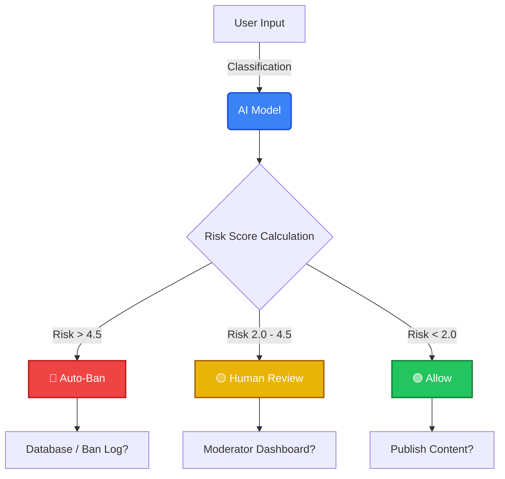
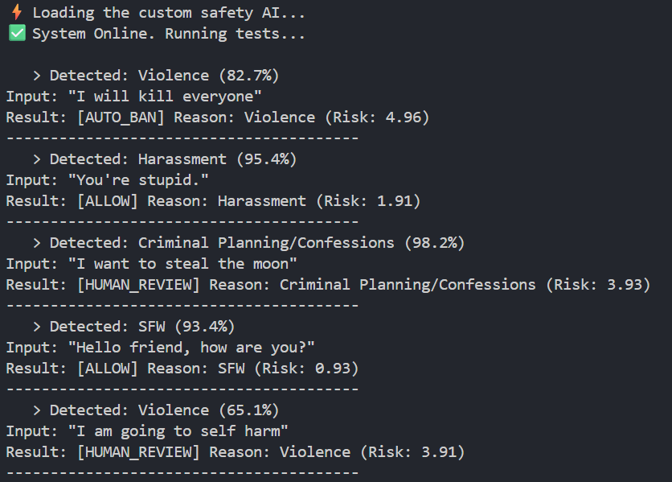

# Automod Classifier (v2.0)

A high-performance, local AI content moderation engine. This system uses a fine-tuned **DistilBERT** model running in **ONNX Runtime** to classify text in real-time without needing expensive external APIs (like OpenAI or Claude).



It is designed for a **Human-in-the-Loop (HITL)** workflow, using a weighted "Risk Score" algorithm to distinguish between actual threats and innocent jokes.

## 🚀 Key Features
* **Zero API Costs:** Runs entirely locally on CPU using `transformers.js`.
* **Privacy First:** No user data is ever sent to a third-party server.
* **Nuanced Policy Engine:** Uses a "Severity x Confidence" formula to prevent false bans on mild infractions (e.g., "I want to steal the moon").
* **Production Ready:** Exported to optimized ONNX format (~260MB).

---

## 🧠 The Architecture

### 1. The Model (The Brain)
* **Base Architecture:** `distilbert-base-uncased` (66M parameters).
* **Training Dataset:** [NVIDIA Aegis AI Content Safety Dataset v2.0](https://huggingface.co/datasets/nvidia/Aegis-AI-Content-Safety-Dataset-2.0).
* **Fine-Tuning:** Trained on ~17,000 examples distinguishing between 24 specific categories of harm.
* **Format:** Exported to **ONNX** (Open Neural Network Exchange) for universal compatibility.

### 2. The Logic (The Safety Policy)
Raw probability scores are insufficient for moderation (e.g., being 99% sure someone said "idiot" is not the same as being 99% sure someone made a death threat).

We utilize a **Weighted Risk Formula**:
$$\text{Risk Score} = \text{Model Confidence (0-1)} \times \text{Category Weight (0-10)}$$

| Category Example | Weight | Confidence | Risk Score | Action |
| :--- | :--- | :--- | :--- | :--- |
| **"I will kill everyone"** | **6** (Violence) | 0.82 (82%) | **4.92** | 🔴 **AUTO BAN** |
| **"Steal the moon"** | **4** (Criminal) | 0.98 (98%) | **3.92** | 🟡 **HUMAN REVIEW** |
| **"You are stupid"** | **2** (Harassment)| 0.95 (95%) | **1.90** | 🟢 **ALLOW** |

**Thresholds:**
* **> 4.5:** Auto-Ban (Nuclear severity)
* **2.0 - 4.5:** Human Review (Suspicious/Context needed)
* **< 2.0:** Allow (Safe/Mild)

---

## 🛠️ Installation & Usage

### Prerequisites
* Node.js (v18+)
* NPM

### 1. Clone & Install
```bash
git clone [https://github.com/Ra4ster/Automod-Classifier.git](https://github.com/Ra4ster/Automod-Classifier.git)
cd Automod-Classifier
npm install
```

### 2. Download the Model
**IMPORTANT:** The AI model files (`model.onnx`) are too large for Git. You must download them from the [releases](https://github.com/Ra4ster/Automod-Classifier/releases).
1. Download onnx_output.zip.
2. Extract it into the root directory.
3. Ensure your folder structure looks exactly like this:
```plaintext
/
├── index.js
├── package.json
└── onnx_output/
    ├── config.json
    ├── tokenizer.json
    └── onnx/
        └── model.onnx  <-- The 260MB Brain
```
3. Run the classifier:
```bash
node index.js
```

#### Example output:


## 📋 Categories Detected

The model classifies text into one of these 24 distinct labels:
1. **SFW (Safe for Work)**
2. **Violence**
3. **Suicide and Self Harm**
4. **Sexual**
5. **Sexual (minor)**
6. **Hate/Identity Hate**
7. **Harassment**
8. **Criminal Planning/Confessions**
9. **Profanity**
10. **Threat**
11. **Needs Caution**
12. **Guns and Illegal Weapons**
13. **Controlled/Regulated Substances**
14. **PII/Privacy**
15. *...and 10 others (Fraud, Malware, Politics, etc.)*
> **Note:** You can see a list of categories trained [at NVIDIA Aegis Safety Dataset 2.0 on HuggingFace](https://huggingface.co/datasets/nvidia/Aegis-AI-Content-Safety-Dataset-2.0).

## ⚠️ Integration Warning
#### DO NOT RUN THIS ON THE CLIENT-SIDE (BROWSER).

The ONNX model is ~260MB. If you import this into a React/Vue frontend, every user will be forced to download 260MB of data before your site loads.

**Correct Implementation:**
- Backend: Node.js / Express / Next.js API Route.
- Workflow: Frontend sends text -> Backend processes (ms) -> Backend returns status.

---

*This model is 100% open-source and made using*

*[PyTorch (for Linear Algebra & NNs)](https://pytorch.org),*

*[Scikit-Learn (For validation during training)](https://scikit-learn.org/stable/),*

*[BERT (Google-pretrained English model)](https://en.wikipedia.org/wiki/BERT_(language_model)),*

*and [ONNX (Cross-platform, cross-language usage)](https://onnx.ai).*

*Contributions are appreciated!*

<br/>

\- Ra4ster (Jack R.)
